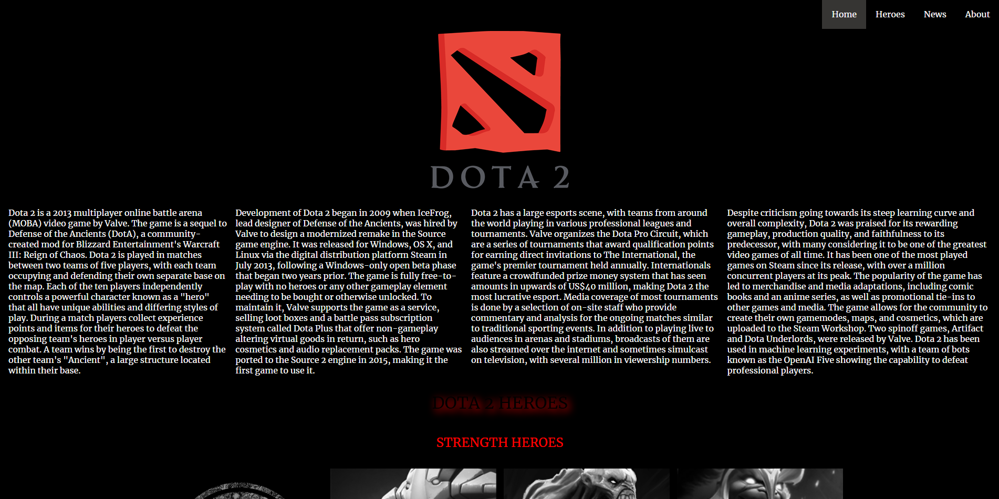

# Dota 2

This is a website about what is Dota 2

Dota 2 is a 2013 multiplayer online battle arena (MOBA) video game by Valve. The game is a sequel to Defense of the Ancients (DotA), a community-created mod for Blizzard Entertainment's Warcraft III: Reign of Chaos. Dota 2 is played in matches between two teams of five players, with each team occupying and defending their own separate base on the map. Each of the ten players independently controls a powerful character known as a "hero" that all have unique abilities and differing styles of play. During a match players collect experience points and items for their heroes to defeat the opposing team's heroes in player versus player combat. A team wins by being the first to destroy the other team's "Ancient", a large structure located within their base. Dota 2 is a multiplayer online battle arena (MOBA) video game in which two teams of five players compete to destroy a large structure defended by the opposing team known as the "Ancient" whilst defending their own. As in Defense of the Ancients, the game is controlled using standard real-time strategy controls, and is presented on a single map in a three-dimensional isometric perspective. Ten players each control one of the game's 124 playable characters, known as "heroes", with each having their own design, strengths, and weaknesses. Heroes are divided into two primary roles, known as the core and support.

You can access module 2 checkpoint website with this [link!](https://65d9f928c4acfbff678568b5--soft-genie-720dcf.netlify.app/)

# Module 2 Assignment

## Netlify Sign up process & connect Netlify to GitHub project

### Log in or Sign Up for a Netlify Account

- First, go to the Netlify website: https://www.netlify.com/.
- Click the Log in button if you already have an account, or Sign Up to create a new one.
- In this guide, we will log in using a GitHub account.

### Import Your Project

- Once logged in, select Sites from the sidebar menu.
- Click the Add new site button and choose Import an existing project.

  

- You will be directed to a page to choose the source of your project deployment.
- Click the Deploy with GitHub button to connect your GitHub project to Netlify.

  

### Connect Your GitHub Account

- Enter your GitHub credentials if you haven't logged in to Netlify using GitHub.
- Select the RevoU-FSSE-4 repository since the module 2 project is located there.

  

### Make Sure Your Project is Public

- Before selecting the project you want to connect, make sure it is set to public so it can be accessed.
- If it is still private, you can change the project settings in GitHub.

### Deploy Your Project

- Select the project you want to connect and click the Deploy (project name) button.
- Wait until the project finishes deploying through Netlify.

### Check Your Website

- Once the project has been successfully deployed, click the deployed website page to check your website.

  

## Auto Deployment on GitHub with Netlify

### Verify the Website Connection to GitHub

- To check if auto deployment is working, first make sure the website you deployed is connected to the GitHub repository.
- You can see this in the Site Overview menu on Netlify.

  

### Make Changes to the Website Code

- Next, open the website of the project that is already connected to GitHub and try to make changes to the website through the project's code content.
- In this case, we will try to change the background color of the website.
- Then, do git add, git commit, and git push to the main branch of the project in GitHub.

  #### Website Pages Before Changes

  

### Check for Auto Deployment on Netlify & Verify the Website Updates

- After pushing to the main branch, you can check on Netlify if your project has been automatically deployed through the Production Deploys menu.
- If the production status is Published, you can open the website to check if it has been updated according to what you pushed to the main branch.

  

### Confirm Successful Auto Deployment

- If the website has changed, then the auto deployment process from GitHub through Netlify has been successful.
  #### Website Pages After Changes
  

## How to connect custom domain and DNS
